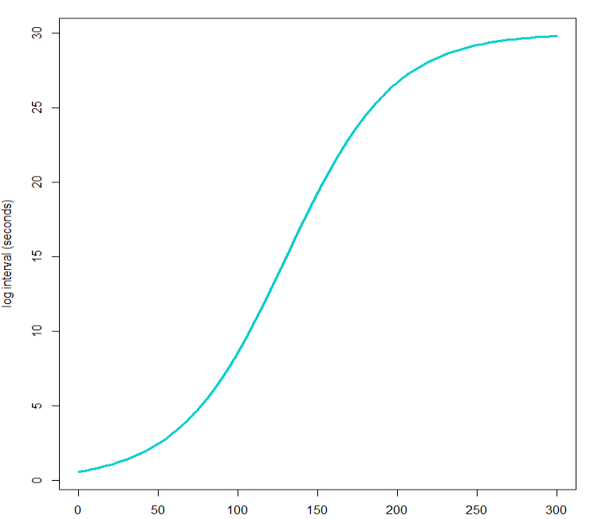
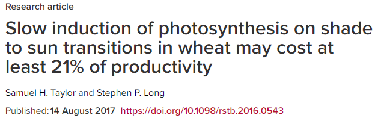

class: animated, fadeIn
# 示例2

.large[例如我们需要记录一个叶片在光强在突然变化后的数据，我们期望能以变化的时间间隔记录数据，在最初的时间，光合速率剧烈变化，我们希望能以很短的时间间隔记录数据，然后光合数据变化减缓，变化需要时间的气孔导度等数据也不需要快速记录，这样我们再使用比较长的时间间隔来记录。

一直以非常高的频率计数不是不行，只是增加了我们后续处理数据的量。


- 控制光强的变化为 1500，50， 1500

- 使用逻辑方程（即著名的 S 型曲线）来控制记录的间隔，初期间隔短，中期时间间隔快速增加，后期几乎不变，记录 15 mins 中。

]
---
class: animated, fadeIn
# 演示前详解


.pull-left[### 构造函数

<br />
<br />
<br />

我们使用典型的逻辑回归方程构造记录间隔的函数：

$$f(t)=\frac{30}{1+50e^{-0.03t}}$$

]

.pull-right[
```{r, fig.retina=1, fig.align='right'}

```
]

---
class: animated, fadeIn
# 几个关键的 STEPS 设置

```python
ASSIGN("logint",
	exp="lambda x: 30/(1+50*math.exp(-0.03*x))+0"),
ASSIGN("test",
	exp="lambda x: x if x >= 1 else 0"),
LOOP(list="1500,50,1500",
	var="x",
	steps=(
		SETCONTROL("Qin","x","float"),
		LOOP(dur="15",
			units="Minutes",
			var="t",
			mininc="test(logint(t))",
			steps=(
				LOG(avg="Off",
					match="Off",
					flr="0: Nothing"),
			)
		),
	)
)
```
---
class: animated, fadeIn
# 几个 STEPS 中的知识点

- `lambda` Python 的匿名函数。

- `ASSIGN`  将表达式赋给变量。`ASSIGN('logint', exp ="lambda x:30/(1+50*math.exp(-0.03*x))")`，执行时会转换为： `logint = lambda x:30/(1+50*math.exp(-0.03*x))`，即记录时间间隔的变量为 logint。

- `math.exp` Python `math` 库中的自然常数。

- `LOOP`
  - 光强的控制相当于 Python 的 `for` 循环，`for x in [1500, 50, 1500]` 设置 `Qin = x`
  - 第二个 LOOP 其实也是 `for` 循环，`var `定义的 t 指从循环开始到现在的时间，`mininc` 是这个 LOOP 一个循环最小的等待时间，0 为等待 6800 有新数据记录。利用该参数和下面的写法实现最小等待 1 s 计数。
  ```python
ASSIGN("test", exp="lambda x: x if x >= 1 else 0")
test(logint(t))
  ```
  
- LOG 项为记录数据，这里参数的意思是不取平均值，不匹配，不记录荧光。
  
---

class: animated, fadeIn, center, middle, inverse

# .large[示例 2 的演示]

---
class: animated, fadeIn
# 示例3：时间序列的重现

<br />
<br />
在实际应用中，我们可能需要重现一个时间序列的变化，这十分有用，例如我们通过记录一段时间内林下光斑的变化，然后利用 LI-6800 重现这个时间段内的变化，来进行光合参数的测量。

<br />
<br />
1. 记录一段时间环境的光强变化，并将时间和对应的光强存储到文件。

2. 运行另一个 BP，将上面的数据文件读取后，按照文件的光强记录一段时间的光强变化。
---
class: animated, fadeIn
# 关键的 STEPS

```python
ASSIGN("f",
	exp="open('/home/licor/logs/light_series.txt','w')"),
ASSIGN("q",
	dd=DataDict('PPFD_out','Meas'),
	track=True),
EXEC(0,source="print(\"Time,Light\",file=f)"),
LOOP(dur="1",
	units="Hours",
	mininc="2",
	steps=(
		ASSIGN("hhmmss",
			exp="datetime.now().strftime(\"%H:%M:%S\")"),
		ASSIGN("line",
			exp="'{0},{1}'.format(hhmmss,q)"),
		EXEC(0,source="print(line,file=f)"),
	)
),
EXEC(0,source="f.close()")
```
---
class: animated, fadeIn

# 几个 STEP 的解释
- 打开（新建）一个名为 light_series.txt 的文件，并对其进行写入操作
 ```python
 open('/home/licor/logs/light_series.txt','w')"
 ```
- 执行一个 python 语句，将其 Time 和 Light 作为表头存储到打开的文件中
 ```python
 EXEC(0,source="print(\"Time,Light\",file=f)")
 ```

- 利用 `datetime.now` 输出时间，并将其输出格式定义为 ISO 格式
 ```python
 "datetime.now().strftime(\"%H:%M:%S\")"
 ```
- 将时间和光强利用 format 格式化为逗号分隔符 
 ```python
'{0},{1}'.format(hhmmss,q)
 ```

---
class: animated, fadeIn
# 关键的 STEPS 及解释

```python
LOOP(file="\"/home/licor/logs/light_series.txt\"",
	parse=True,
	delim="Comma",
	skip="1",
	var="q",
	mininc="2",
	steps=(
		# Set a control: SETCONTROL('target', 'value', 'eval' [,opt_target=''])
		SETCONTROL("Qin","q[1]","float"),
	)
)
```

- LOOP 可以直接读取文件
- delim 指定分隔符
- mininc 每个光强的持续时间是 2 s

---
class: animated, fadeIn, center, middle, inverse

# .large[示例 3 的演示]

---
class: animated, fadeIn

# 示例4：不同 $CO_2$ 浓度的光响应曲线

我们要做不同 $CO_2$ 浓度下的光响应曲线，有几个问题：

- 能够根据物种定义不同的光强梯度

- 能够根据需要定义不同的  $CO_2$ 的浓度

- 能够根据需要定义不同的最大最小等待时间，例如按照正常的情况，我们第一个点无需等待太久，因为我们要在最高光强下等待其稳定才开始测量，但如果考虑到了 $CO_2$  需要变化，我们第一个点则需要设置的等待时间较长，第二个点，第三个点反而是因为一直处于饱和光强下，等待时间可适当降低。

---
class: animated, fadeIn
# 方法1： 关键的 STEP
```python
TABLE("outer_table",
	[('CO2_r', [300, 400, 500, 600])]),
TABLE("inner_table",
	[('Qin', [1500, 1250, 1000, 750, 500, 250, 100]),
		('minWait', [300, 60, '', '', '', '', ''], {'format': ['f', 1, 2], 'units': 'secs'}),
		('maxWait', [500, 120, '', '', '', '', ''], {'format': ['f', 1, 2], 'units': secs'}),
		]),
LOOP(list="outer_table",
	var="outer_index",
	steps=(
		LOG(open="\"/home/licor/logs/co2_\"+str(outer_index)",app=False),
		LOG(rem="'automatic file'"),
		LOOP(list="inner_table",
			var="inner_index",
			steps=(
				WAIT(min="minWait",max="maxWait",early="False"),
				LOG(avg="On"),
			)
		)
```
---
class: animated, fadeIn
# 关键 STEP 详解
```python
TABLE("outer_table",
	[('CO2_r', [300, 400, 500, 600])]),
TABLE("inner_table",
	[('Qin', [1500, 1250, 1000, 750, 500, 250, 100]),
		('minWait', [300, 60, '', '', '', '', ''], {'format': ['f', 1, 2], 'units': 'secs'}),
		('maxWait', [500, 120, '', '', '', '', ''], {'format': ['f', 1, 2], 'units': secs'}),
		])
```
- TABLE 是可以作为 LOOP 的 list 列表来运行的，因此比那些一个 TABLE 后，可以使用 LOOP 来遍历其中的所有元素。

- 第一个变量为 TABLE 的名字，方便后面 LOOP 调用。

- 紧随其后的我们需要设置的为我们期望的控制项

- .red[此处应演示添加 dialog 修改数值的方法，待测试，待补充]

---
class: animated, fadeIn

# 关键 STEP 详解

```python
LOG(open="\"/home/licor/logs/co2_\"+str(outer_index)",app=False),
WAIT(min="minWait",max="maxWait",early="False")
```
- 为方便后续数据处理，将记录文件命名为 co2_+浓度的格式

- 利用 WAIT 实现等待稳定后匹配，此处关闭了 early match 功能

---
class: animated, fadeIn
# 方法2： 关键的 STEPs

```python
EXEC(0,file="/home/licor/resources/lib/list_utility.py"),
ASSIGN("q",
	exp="linearList(1500,50,8)"),
ASSIGN("minWait",
	exp="60"),
ASSIGN("firstWait",
	exp="300"),
LOOP(list="400,300,200,100",
	var="co2",
	steps=(
		SETCONTROL("CO2_s","co2","float"),
		LOG(open="\"/home/licor/logs/co2_\"+str(co2)",app=False),
		LOG(rem="'automatic file'"),
		LOOP(count="len(q)",
			var="i",
			steps=(
				SETCONTROL("Qin","q[i]","float"),
				ASSIGN("w",
					exp="firstWait if i==0 else minWait"),
				WAIT(min="w",max="2*w",early="False"),
				LOG(avg="On"),
			)
		)
```

---
class: animated, fadeIn

# 关键 STEP 详解
```python
EXEC(0,file="/home/licor/resources/lib/list_utility.py")
linearList(1500,50,8)
```
-  调用 list_utility 的 linearList 生成光强梯度。.red[应添加两个或三个来适当变化梯度，待测试，待补充]

```python
LOOP(count="len(q)",
			var="i",
			steps=(
				SETCONTROL("Qin","q[i]","float"),
				ASSIGN("w",
					exp="firstWait if i==0 else minWait"),
				WAIT(min="w",max="2*w",early="False"),
```
- 如果是第一个设置的光强梯度，那么等待的最小时间为 firstWait。也就是 300 s，否则为最小等待时间， 最大等待时间为最小等待时间的 2 倍。

---
class: animated, fadeIn, center, middle, inverse

# .large[示例 4 的演示]

---
class: animated, fadeIn

# 示例5：模拟多云天气的可变光的测量

```{r cloud, fig.retina=1}

```
- 控制稳定的 VPD 和叶温
- 设定 400 ppm 的 $CO_2$ 和 1200 的光强对叶片进行诱导
- 设置低光 50 持续 30 mins，高光 1200 持续 10 mins 的变化
- 变化分别在 $CO_2$ 为 50， 100， 200， 300， 400， 500， 600， 800， 1000 下进行

---
class: animated, fadeIn
# 推荐方法：

- 定义一个 subroutine，用于自动计数和控制光强和 $CO_2$ 浓度。

- 使用 Call 反复调用，来修改浓度和光强的变化

- 在开始变化之前的诱导时，利用 WAIT 等待稳定，然后匹配

- 整个测量过程中控温，因为 range match 的存在，无需匹配
---
# 关键的 STEP
```python
WAIT(min="60",max="60*15",early="False"),
CALL("var_cr_qin", ['50', '50', '30', '10']),
CALL("var_cr_qin", ['50', '500', '15', '10']),
CALL("var_cr_qin", ['100', '50', '30', '10']),
CALL("var_cr_qin", ['100', '500', '15', '10']),
DEFINE("var_cr_qin",
	[['cr', 'Value'], ['qin', 'Value'], ['duration', 'Value'], ['intv', 'Value']],
	steps=(''])
		SETCONTROL("Qin","qin","float"),
		SETCONTROL("CO2_r","cr","float"),
		LOOP(dur="duration",
			units="Minutes",
			steps=()
				WAIT(dur="intv",units="Seconds"),
				LOG(),
			)
		),
	)
)
```
---
class: animated, fadeIn

# 关键步骤解释

### - DEFINE 是定义一个 subroutine，实际上是一个函数，我们此处定义了控光、控二氧化碳、控测量间隔和时长 4 个参数。注意，DEFINE 的位置不影响程序

### - CALL 是调用函数，分别输入不同的上述 4 个参数，做对应的控制测量

### - WAIT 除了等待时间外，还可以用于等待分析器读数稳定
---
class: animated, fadeIn, center, middle, inverse

# .large[示例5的演示]
---
class: inverse, center, middle, animated, fadeIn

# .large[谢谢！]

```{r}

```
## 关注公众号后获取更多精彩内容