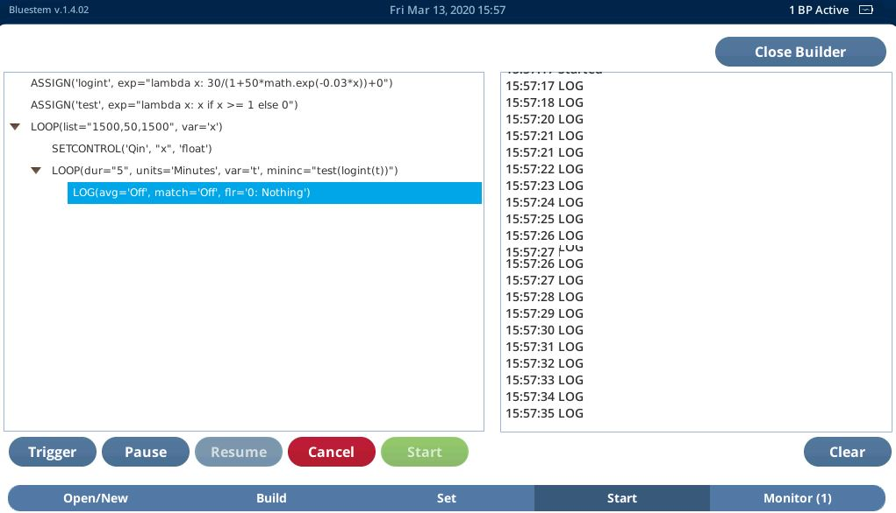
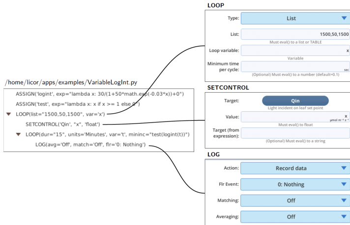

background-image: url(https://s2.ax1x.com/2020/03/09/8S2l7T.png)

background-size: cover

class: left, middle, animated, fadeIn


# 1. 什么是 BP

# 2. STEPS 的基本组成

# 3. 各部分的功能

# 4. 具体实例的详解

---
class: animated, fadeIn

# 后台程序 (BP)

#### .tomato.large.bold[BP 的定义：]

BP（Background Program） 指的是一系列步骤的集合，能够在 6800 后台运行以完成各种任务。

#### .tomato.large.bold[什么是步骤（step）:]

本质上是一个未经执行的字符串中的 Python 表达式（expression），当其被调用时，表达式被 Python 的 `eval()` 或 `exec()` 执行。多数情况下，实际上被执行的是一个步骤的集合，以实现更复杂的目的，这个步骤的集合本质上是 Python 中的列表（list）

也就是说 Background Program .large.purple.bold[本质上是 Python 程序]，而 LI-6800 就像是是一台安装了 BSD 的电脑，来执行这些 BP。

---
class: animated, fadeIn

# 有益的与 Python 相关的 BP 基础知识

- Sequences：Python 对**有序**数据集的总称，有序是指我们可以赋给数据集中每个元素一个数值，可以通过索引（index）来调用单个元素或多个元素，**Python 索引是以 0 为起始，也就是第一个元素应为 [0]**

- list: 列表，Python 中最万能的数据类型，写法是在 ** [] ** 内的，使用逗号分隔的值（values 或 items）。它有个最大的特点就是值的类型不必相同,例如：

```python
list1 = ["LI-6800", 21, 0.08, "BP"]
```

- STEP：本质上是 list，Python 内并无此名词，是 LICOR 定义的一个由字符组成的列表，因为这个 list 的内容要被 `eval()` 或 `exec()` 执行，所以这些字符的写法要符合 LICOR 定义的相关模块的要求。例如列表中常见的几种赋值 ASSGIN 的写法为：

```python
steps = [ASSIGN("Fs", dd=DataDict('Flow_s','Status')),
ASSIGN("isOpen", exp="Fs < 10"),
ASSIGN("tleafok",
			exp="lambda t: 1 if (t != 0) and (t > -20) and (t < 60) else 0"),
ASSIGN("numTCs",
			exp="tleafok(data['Tleaf']) + tleafok(data['Tleaf2'])")
]
```
---
class: animated, fadeIn

# 有益的与 Python 相关的 BP 基础知识

- eval: STEP 中的内容是字符串，字符串是无法执行的，需要转为表达式（可以赋给变量的任意的对象），并且 eval 也只能接受单个表达式，并返回表达式的值。

- exec：与 eval 类似，但不返回表达式的值，并能接受动态创建的语句或程序。

在 BP 中，exec 实际由 EXEC 来替代。使用 BP 需要首先明白两点：

1. 运行 BP 并不是运行 .py 文件，而是 .py 文件首先被编译（eval()）以获取 STEPS 列表，然后 BP 使用这些 STEPS 作为数据来运行。
2. 我们创建的变量是存在于列表中，变量和表达式在这一阶段必须以字符的形式存在。例如上一页中演示的 ASSIGN 第一个参数，实际应为一个变量（该阶段还不是），此时必须加引号将其作为字符存在。也就是说，我们写的代码必须发送到 eval() 或 exec() 两次，第一次是创建 STEP（也就是说最初创建的是普通的 list，被 eval() 或 exec() 处理后变为 STEP），第二次是 STEP 来处理其参数。


???

exec is for statement and does not return anything. eval is for expression and returns value of expression.
expression means "something" while statement means "do something".

---
class: animated, fadeIn
# BP 与 AutoProgram？

在 LI-6800 上内置了功能全面的 AutoProgram，为什么又有了 BP 呢，二者有什么不同？

### 二者差异主要体现在：

- BP 能实现所有的 AutoProgram，但 AutoProgram 对新手友好（无需编程，直接使用）。

- AutoProgram 每次只能执行一个，但理论上讲 BP 可以同时执行任何个数。

- BP 能够实现 AutoProgram 不能实现的功能，即可以在规则内定制自己所需要的程序
---
class: animated, fadeIn

# STEPS 的基本组成

BP 的编程实际上是编辑 STEPS 或者说是即将被 eval() 或 exec() 的 list 的过程，所以可以说掌握了 STEPS 的编辑过程，就学会使用 BP 了（剩下的工作是系统安装的 python 将 STEPS 作为参数的运行过程）。我们首先看一下其组成：

---

<iframe src="./statement.html" width=80% height=80% frameborder=0  allowtransparency="true"> </iframe>

.footnote[### STEPS 的语句（statement）]
---

<iframe src="./flow-control.html" width=80% height=80% frameborder=0 allowtransparency="true"> </iframe>

.footnote[### STEPS 的流控制（program flow control）]

---
class: animated, fadeIn

# 可以直接使用的库

<iframe src="./defines.html" width=80% height=80% frameborder=0 allowtransparency="true"> </iframe>

---
class: animated, fadeIn

# 可以直接使用的库

<iframe src="./groups.html" width=80% height=80% frameborder=0 allowtransparency="true"> </iframe>

---
class: animated, fadeIn
# 使用举例

例如我们需要记录一个叶片在光强在突然变化后的数据，我们期望能以变化的时间间隔记录数据，在最初的时间，光合速率剧烈变化，我们希望能以很短的时间间隔记录数据，然后光合数据变化减缓，变化需要时间的气孔导度等数据也不需要快速记录，这样我们再使用比较长的时间间隔来记录。

一直以非常高的频率计数不是不行，只是增加了我们后续处理数据的量。

我们就以这个例子来介绍一下 BP 的基本使用，我们要实现的控制：

- 控制光强的变化为 1500，50， 1500

- 使用逻辑方程（即著名的 S 型曲线）来控制记录的间隔，初期渐渐短，中期快速增加，后期几乎不变，记录 15 mins 中。

- 因为时间短，为避免意外，记录时关闭 match。

---
class: animated, fadeIn
# 程序的运行

```{r, fig.retina=2, fig.align='center'}

```
---
class: animated, fadeIn
# 程序解释


.pull-left[### 构造函数

我们使用典型的逻辑回归方程构造记录间隔的函数：

$$f(t)=\frac{30}{1+50e^{-0.03t}}$$

]

.pull-right[
```{r, fig.retina=1, fig.align='right'}
include_graphics("./img/logistic.png")
```
]

---
class: animated, fadeIn
# 几个关键的 STEPS 设置
.left-column[### 关键的 STEPS


- ASSIGN
- LOOP
- SETCONTROL
- LOG

]

.right-column[
```{r, fig.retina=2, fig.align='center'}

```
]


---
class: animated, fadeIn
# 几个 STEPS 的知识点

- `lambda` Python 的匿名函数。

- `ASSIGN` 可简单的理解为 = ，例如 `ASSIGN('logint', exp ="lambda x:30/1+50*math.exp(-0.03*x)")`，执行时会转换为： `logint = lambda x:30/1+50*math.exp(-0.03*x)`，即记录时间间隔的变量为 logint。第二个是一个条件判断语句，意思是当x小于 1 时，使其等于 0。

- `math.exp` Python `math` 库中的自然常数。

- `LOOP`
  - 光强的控制相当于 Python 的 `for` 循环，`for x in [1500, 50, 1500]` 设置 `Qin = x`
  - 第二个 LOOP 其实也是 `for` 循环，`var `定义的 t 是一个时间的变量，记录从开始到现在的时间，也就是 `for t < 15*60`，`mininc` 是这个 LOOP 一个循环最小的等待时间，0 为等待 6800 有新数据记录。也就是这里的意思是，如果时间小于 1，则 `mininc = 0`, 仪器等待有新数据后记录数据，如果大于 1 则到达这个时间后才记录数据。
  
- LOG 项为记录数据，选项的意思是不取平均值，不匹配，不记录荧光。
  
---


---
class: animated, fadeIn

background-image: url("https://s1.ax1x.com/2020/04/02/GJimlV.png")
background-size: contain
