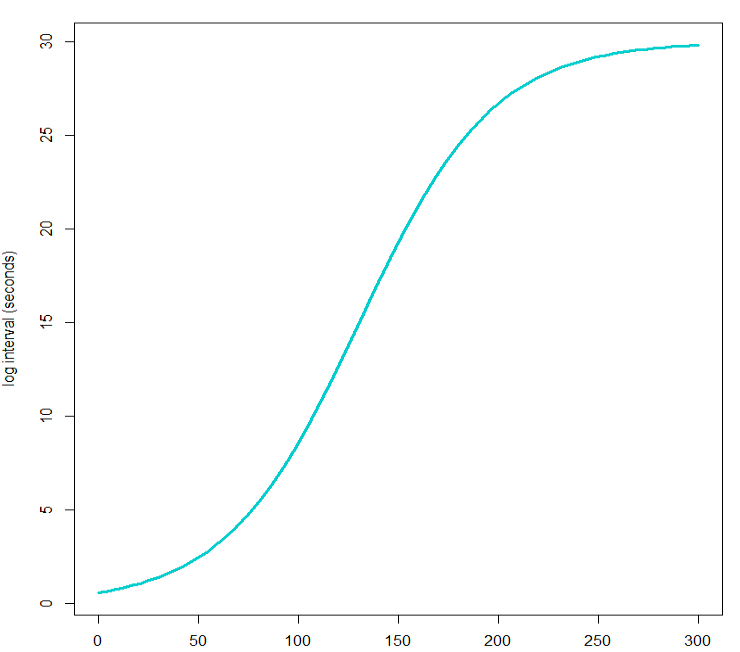

background-image: url(https://s2.ax1x.com/2020/03/09/8S2l7T.png)

background-size: cover

class: left, middle, animated, fadeIn

# 主要内容

.pull-left[
# 1. 什么是 BP

# 2. STEP 的组成

# 3. STEP 组分介绍
]

.pull-right[
# 4. BP 已有的库

# 5. BP 界面介绍

# 6. BP 程序示例
]


---
class: animated, fadeIn, center, middle, inverse

# .large[BP 程序介绍]
---
class: animated, fadeIn

# 后台程序 (BP)

#### .tomato.large.bold[BP 的定义：]

BP（Background Program） 指的是一系列步骤的集合，能够在 6800 后台运行以完成各种任务。

#### .tomato.large.bold[什么是步骤（step）:]

本质上是一个未经执行的字符串中的 Python 表达式（expression），当其被调用时，表达式被 Python 的 `eval()` 或 `exec()` 执行。多数情况下，实际上被执行的是一个步骤的集合，以实现更复杂的目的，这个步骤的集合本质上是 Python 中的列表（list）

也就是说 Background Program .large.purple.bold[本质上是 Python 程序]，而 LI-6800 就像是是一台安装了 BSD 的电脑，来执行这些 BP。

---

class: animated, fadeIn, center, middle, inverse

# .large[BP 相关的知识]
---
class: animated, fadeIn

# 有益的与 Python 相关的 BP 基础知识

- Sequences：Python 对**有序**数据集的总称，有序是指我们可以赋给数据集中每个元素一个数值，可以通过索引（index）来调用单个元素或多个元素，**Python 索引是以 0 为起始，也就是第一个元素应为 [0]**

- list: 列表，Python 中最万能的数据类型，写法是在 ** [] ** 内的，使用逗号分隔的值（values 或 items）。它有个最大的特点就是值的类型不必相同,例如：

```python
list1 = ["LI-6800", 21, 0.08, "BP"]
```

- STEP：本质上是 list，Python 内并无此名词，是 LICOR 定义的一个由字符组成的列表，因为这个 list 的内容要被 `eval()` 或 `exec()` 执行，所以这些字符的写法要符合 LICOR 定义的相关模块的要求。例如列表中常见的几种赋值 ASSGIN 的写法为：

```python
steps = [ASSIGN("Fs", dd=DataDict('Flow_s','Status')),
ASSIGN("isOpen", exp="Fs < 10"),
ASSIGN("tleafok",
			exp="lambda t: 1 if (t != 0) and (t > -20) and (t < 60) else 0"),
ASSIGN("numTCs",
			exp="tleafok(data['Tleaf']) + tleafok(data['Tleaf2'])")
]
```
---
class: animated, fadeIn

# 有益的与 Python 相关的 BP 基础知识

- eval: STEP 中的内容是字符串，字符串是无法执行的，需要转为表达式（可以赋给变量的任意的对象），并且 eval 也只能接受单个表达式，并返回表达式的值。

- exec：与 eval 类似，但不返回表达式的值，并能接受动态创建的语句或程序。

在 BP 中，exec 实际由 EXEC 来替代。使用 BP 需要首先明白两点：

1. 运行 BP 并不是运行 .py 文件，而是 .py 文件首先被编译（eval()）以获取 STEPS 列表，然后 BP 使用这些 STEPS 作为数据来运行。
2. 我们创建的变量是存在于列表中，变量和表达式在这一阶段必须以字符的形式存在。例如上一页中演示的 ASSIGN 第一个参数，实际应为一个变量（该阶段还不是），此时必须加引号将其作为字符存在。也就是说，我们写的代码必须发送到 eval() 或 exec() 两次，第一次是创建 STEP（也就是说最初创建的是普通的 list，被 eval() 或 exec() 处理后变为 STEP），第二次是 STEP 来处理其参数。


???

exec is for statement and does not return anything. eval is for expression and returns value of expression.
expression means "something" while statement means "do something".

---
class: animated, fadeIn, center, middle, inverse

# .large[BP 与 AutoProgram 的差别]

---
class: animated, fadeIn
# BP 与 AutoProgram？

在 LI-6800 上内置了功能全面的 AutoProgram，为什么又有了 BP 呢，二者有什么不同？

### 二者差异主要体现在：

- BP 能实现所有的 AutoProgram，但 AutoProgram 对新手友好（无需编程，直接使用）。

- AutoProgram 每次只能执行一个，但理论上讲 BP 可以同时执行任何个数。

- BP 能够实现 AutoProgram 不能实现的功能，即可以在规则内定制自己所需要的程序
---

class: animated, fadeIn, center, middle, inverse

# .large[STEP 介绍]
---
class: animated, fadeIn

# STEPS 的基本组成

## BP 的执行需要：

### 1. 编写 STEPS

### 2. STEPS 将被 eval() 或 exec()，生成一个参数化的 list 的过程

### 3. 系统安装的 python （使用 Python 3） 使用 BP 将 STEPS 作为参数的运行过程

.large.tomato[其中，我们需要做的工作仅仅是 STEPS 的编写过程。因此掌握 STEPS 的各个命令是写好 BP 的前提，我们先了解一下 BP 的命令。]
---
# 语句（statement）
<iframe src="./statement.html" width=80% height=80% frameborder=0  allowtransparency="true"> </iframe>

---
# 流控制（program flow control）
<iframe src="./flow-control.html" width=80% height=80% frameborder=0 allowtransparency="true"> </iframe>


---
class: animated, fadeIn, center, middle, inverse

# .large[STEP 已有的库（library）]

---
class: animated, fadeIn

# 已有的库

<iframe src="./defines.html" width=80% height=80% frameborder=0 allowtransparency="true"> </iframe>

---
class: animated, fadeIn

# 已有的库

<iframe src="./groups.html" width=80% height=80% frameborder=0 allowtransparency="true"> </iframe>

---
class: animated, fadeIn, center, middle, inverse

# .large[BP 使用界面（联机演示）]

---

class: animated, fadeIn, center, middle, inverse

# .large[BP 程序示例]

---
class: animated, fadeIn
# 示例1： 改变环境控制和记录时间的测量

.tomato[以下时间的设置仅为演示所需，可任意更改]

1. 设置 $CO_2R$ 的值为 0，记录 2 min，记录间隔  1 min。

2. 设置 $CO_2R$ 的值为 400，记录 1 min，记录间隔  30 s。

3. 设置 $CO_2R$ 的值为 0，记录 1 min，记录间隔  30 s。

---
class: animated, fadeIn
# 方法1

1. 设置 $CO_2R$ 浓度
2. 根据需要是否设置等待浓度稳定的时间
3. 利用 LOOP 的循环持续时间功能来设置记录的时间和间隔

最后将上述步骤重复 n 次，来完成控制。

---

class: animated, fadeIn
# 方法2

1. 设置 $CO_2R$ 浓度
2. 根据需要是否设置等待浓度稳定的时间
3. 调用 DEFINEs 或 GROUPs 的 autolog 来自动记录一定时间的数据

最后将上述步骤重复 n 次，来完成控制。

注：同方法1没有本质的区别，但胜在减少了编辑的时间或者可以控制某一步不进行。


---
class: animated, fadeIn, center, middle, inverse

# .large[示例 1 的演示]

---
class: animated, fadeIn
# 示例2

.large[例如我们需要记录一个叶片在光强在突然变化后的数据，我们期望能以变化的时间间隔记录数据，在最初的时间，光合速率剧烈变化，我们希望能以很短的时间间隔记录数据，然后光合数据变化减缓，变化需要时间的气孔导度等数据也不需要快速记录，这样我们再使用比较长的时间间隔来记录。

一直以非常高的频率计数不是不行，只是增加了我们后续处理数据的量。


- 控制光强的变化为 1500，50， 1500

- 使用逻辑方程（即著名的 S 型曲线）来控制记录的间隔，初期间隔短，中期时间间隔快速增加，后期几乎不变，记录 15 mins 中。

]
---
class: animated, fadeIn
# 演示前详解


.pull-left[### 构造函数

<br />
<br />
<br />

我们使用典型的逻辑回归方程构造记录间隔的函数：

$$f(t)=\frac{30}{1+50e^{-0.03t}}$$

]

.pull-right[
```{r, fig.retina=1, fig.align='right'}

```
]

---
class: animated, fadeIn
# 几个关键的 STEPS 设置

```python
ASSIGN("logint",
	exp="lambda x: 30/(1+50*math.exp(-0.03*x))+0"),
ASSIGN("test",
	exp="lambda x: x if x >= 1 else 0"),
LOOP(list="1500,50,1500",
	var="x",
	steps=(
		SETCONTROL("Qin","x","float"),
		LOOP(dur="15",
			units="Minutes",
			var="t",
			mininc="test(logint(t))",
			steps=(
				LOG(avg="Off",
					match="Off",
					flr="0: Nothing"),
			)
		),
	)
)
```
---
class: animated, fadeIn
# 几个 STEPS 中的知识点

- `lambda` Python 的匿名函数。

- `ASSIGN`  将表达式赋给变量。`ASSIGN('logint', exp ="lambda x:30/1+50*math.exp(-0.03*x)")`，执行时会转换为： `logint = lambda x:30/1+50*math.exp(-0.03*x)`，即记录时间间隔的变量为 logint。

- `math.exp` Python `math` 库中的自然常数。

- `LOOP`
  - 光强的控制相当于 Python 的 `for` 循环，`for x in [1500, 50, 1500]` 设置 `Qin = x`
  - 第二个 LOOP 其实也是 `for` 循环，`var `定义的 t 指从循环开始到现在的时间，`mininc` 是这个 LOOP 一个循环最小的等待时间，0 为等待 6800 有新数据记录。利用该参数和下面的写法实现最小等待 1 s 计数。
  ```python
ASSIGN("test", exp="lambda x: x if x >= 1 else 0")
test(logint(t))
  ```
  
- LOG 项为记录数据，这里参数的意思是不取平均值，不匹配，不记录荧光。
  
---

class: animated, fadeIn, center, middle, inverse

# .large[示例 2 的演示]

---
class: animated, fadeIn
# 示例3：时间序列的重现

<br />
<br />
在实际应用中，我们可能需要重现一个时间序列的变化，这十分有用，例如我们通过记录一段时间内林下光斑的变化，然后利用 LI-6800 重现这个时间段内的变化，来进行光合参数的测量。

<br />
<br />
1. 记录一段时间环境的光强变化，并将时间和对应的光强存储到文件。

2. 运行另一个 BP，将上面的数据文件读取后，按照文件的光强记录一段时间的光强变化。
---
class: animated, fadeIn
# 关键的 STEPS

```python
ASSIGN("f",
	exp="open('/home/licor/logs/light_series.txt','w')"),
ASSIGN("q",
	dd=DataDict('PPFD_out','Meas'),
	track=True),
EXEC(0,source="print(\"Time,Light\",file=f)"),
LOOP(dur="1",
	units="Hours",
	mininc="2",
	steps=(
		ASSIGN("hhmmss",
			exp="datetime.now().strftime(\"%H:%M:%S\")"),
		ASSIGN("line",
			exp="'{0},{1}'.format(hhmmss,q)"),
		EXEC(0,source="print(line,file=f)"),
	)
),
EXEC(0,source="f.close()")
```
---
class: animated, fadeIn

# 几个 STEP 的解释
- 打开（新建）一个名为 light_series.txt 的文件，并对其进行写入操作
 ```python
 open('/home/licor/logs/light_series.txt','w')"
 ```
- 执行一个 python 语句，将其 Time 和 Light 存储到打开的文件中
 ```python
 EXEC(0,source="print(\"Time,Light\",file=f)")
 ```

- 利用 `datetime.now` 输出时间，并将其输出格式定义为 ISO 格式
 ```python
 "datetime.now().strftime(\"%H:%M:%S\")"
 ```
- 将时间和光强利用 format 格式化为逗号分隔符 
 ```python
{0},{1}'.format(hhmmss,q)
 ```

---
class: animated, fadeIn
# 关键的 STEPS

```python
LOOP(file="\"/home/licor/logs/light_series.txt\"",
	parse=True,
	delim="Comma",
	skip="1",
	var="q",
	mininc="2",
	steps=(
		# Set a control: SETCONTROL('target', 'value', 'eval' [,opt_target=''])
		SETCONTROL("Qin","q[1]","float"),
	)
)
```

---
class: animated, fadeIn

# 几个 STEP 的解释

- LOOP 可以直接读取文件
- delim 指定分隔符
- mininc 每个光强的持续时间是 2 s

---
class: animated, fadeIn, center, middle, inverse

# .large[示例 3 的演示]

---
class: animated, fadeIn

# 示例4：不同 $CO_2$ 浓度的光响应曲线

我们要做不同 $CO_2$ 浓度下的光响应曲线，有几个问题：

- 能够根据物种定义不同的光强梯度

- 能够根据需要定义不同的  $CO_2$ 的浓度

- 能够根据需要定义不同的最大最小等待时间，例如按照正常的情况，我们第一个点无需等待太久，因为我们要在最高光强下等待其稳定才开始测量，但如果考虑到了 $CO_2$  需要变化，我们第一个点则需要设置的等待时间较长，第二个点，第三个点反而是因为一直处于饱和光强下，等待时间可适当降低。

---
class: animated, fadeIn
# 方法1： 关键的 STEP
```python
TABLE("outer_table",
	[('CO2_r', [300, 400, 500, 600])]),
TABLE("inner_table",
	[('Qin', [1500, 1250, 1000, 750, 500, 250, 100]),
		('minWait', [300, 60, '', '', '', '', ''], {'format': ['f', 1, 2], 'units': 'secs'}),
		('maxWait', [500, 120, '', '', '', '', ''], {'format': ['f', 1, 2], 'units': secs'}),
		]),
LOOP(list="outer_table",
	var="outer_index",
	steps=(
		LOG(open="\"/home/licor/logs/co2_\"+str(outer_index)",app=False),
		LOG(rem="'automatic file'"),
		LOOP(list="inner_table",
			var="inner_index",
			steps=(
				WAIT(min="minWait",max="maxWait",early="False"),
				LOG(avg="On"),
			)
		)
```
---
class: animated, fadeIn
# 关键 STEP 详解
```python
TABLE("outer_table",
	[('CO2_r', [300, 400, 500, 600])]),
TABLE("inner_table",
	[('Qin', [1500, 1250, 1000, 750, 500, 250, 100]),
		('minWait', [300, 60, '', '', '', '', ''], {'format': ['f', 1, 2], 'units': 'secs'}),
		('maxWait', [500, 120, '', '', '', '', ''], {'format': ['f', 1, 2], 'units': secs'}),
		])
```
- TABLE 是可以作为 LOOP 的 list 列表来运行的，因此比那些一个 TABLE 后，可以使用 LOOP 来遍历其中的所有元素。

- 第一个变量为 TABLE 的名字，方便后面 LOOP 调用。

- 紧随其后的我们需要设置的为我们期望的控制项

- .red[此处应演示添加 dialog 修改数值的方法，待测试，待补充]


---
class: animated, fadeIn

# 关键 STEP 详解

```python
LOG(open="\"/home/licor/logs/co2_\"+str(outer_index)",app=False),
WAIT(min="minWait",max="maxWait",early="False")
```
- 为方便后续数据处理，将记录文件命名为 co2_+浓度的格式

- 利用 WAIT 实现等待稳定后匹配，此处关闭了 early match 功能

---
class: animated, fadeIn
# 方法2： 关键的 STEPs

```python
EXEC(0,file="/home/licor/resources/lib/list_utility.py"),
ASSIGN("q",
	exp="linearList(1500,50,8)"),
ASSIGN("minWait",
	exp="60"),
ASSIGN("firstWait",
	exp="300"),
LOOP(list="400,300,200,100",
	var="co2",
	steps=(
		SETCONTROL("CO2_s","co2","float"),
		LOG(open="\"/home/licor/logs/co2_\"+str(co2)",app=False),
		LOG(rem="'automatic file'"),
		LOOP(count="len(q)",
			var="i",
			steps=(
				SETCONTROL("Qin","q[i]","float"),
				ASSIGN("w",
					exp="firstWait if i==0 else minWait"),
				WAIT(min="w",max="2*w",early="False"),
				LOG(avg="On"),
			)
		)
```

---
class: animated, fadeIn

# 关键 STEP 详解
```python
EXEC(0,file="/home/licor/resources/lib/list_utility.py")
linearList(1500,50,8)
```
-  调用 list_utility 的 linearList 生成光强梯度。.red[应添加两个或三个来适当变化梯度，待测试，待补充]

```python
LOOP(count="len(q)",
			var="i",
			steps=(
				SETCONTROL("Qin","q[i]","float"),
				ASSIGN("w",
					exp="firstWait if i==0 else minWait"),
				WAIT(min="w",max="2*w",early="False"),
```
- 如果是第一个设置的光强梯度，那么等待的最小时间为 firstWait。也就是 300 s，否则为最小等待时间， 最大等待时间为最小等待时间的 2 倍。

---
class: animated, fadeIn, center, middle, inverse

# .large[示例 4 的演示]

---
class: animated, fadeIn

# 示例5：模拟多云天气的可变光的测量

```{r cloud, fig.retina=1}
include_graphics("./img/cloud.png")
```
- 控制稳定的 VPD 和叶温
- 设定 400 ppm 的 $CO_2$ 和 1200 的光强对叶片进行诱导
- 设置低光 50 持续 30 mins，高光 1200 持续 10 mins 的变化
- 变化分别在 $CO_2$ 为 50， 100， 200， 300， 400， 500， 600， 800， 1000 下进行

---
class: animated, fadeIn
# 方法1：

# 待补充，最原始的方式，一一列出所有控制
可以采取一个浓度变化一次，多列几个文件的形式，方便后面调用
---
# 方法2：

# 待补充，定义subroutine，一一列出所有控制
---
# 示例5的演示：
---
class: inverse, center, middle, animated, fadeIn

# .large[谢谢！]

```{r}

```
## 关注公众号后获取更多精彩内容

